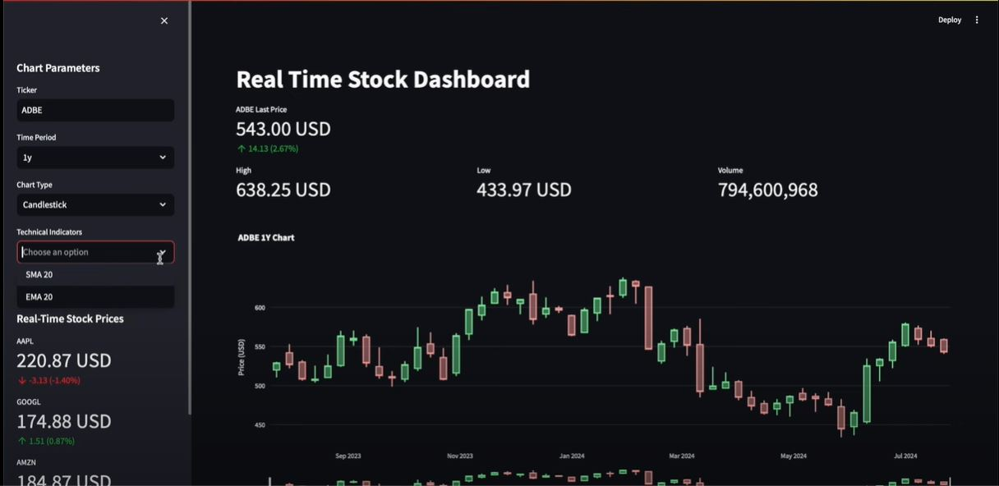
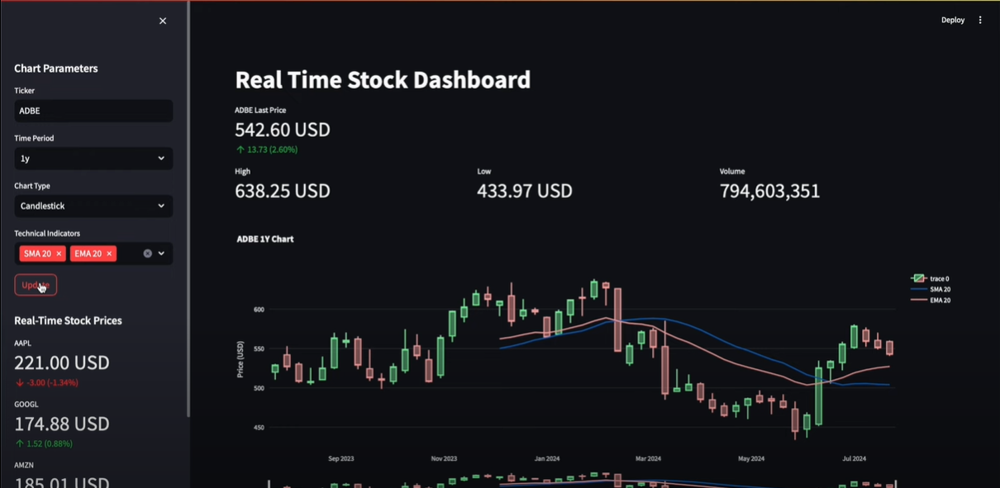
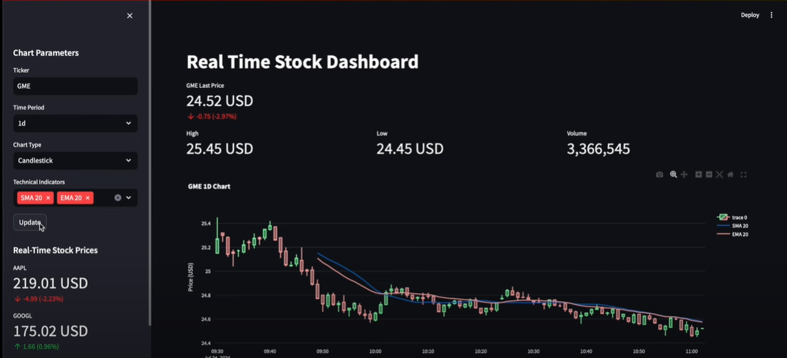

# 📈 Real-Time Stock Dashboard

A Streamlit-based web dashboard for visualizing real-time stock data and applying technical indicators like SMA and EMA using `yfinance` and `ta`.

---

### 📸 Screenshot 1

### 📸 Screenshot 2

### 📸 Screenshot 3 

---

## 🚀 Features

- Real-time stock data using Yahoo Finance (`yfinance`)
- Candlestick and Line charts (via Plotly)
- Technical indicators: 
  - Simple Moving Average (SMA)
  - Exponential Moving Average (EMA)
- Key metrics: Last price, daily change, volume, high & low
- Support for multiple tickers (AAPL, GOOGL, AMZN, MSFT)
- Timezone-aware data (converted to US/Eastern)
- Interactive sidebar to control:
  - Stock ticker
  - Chart type
  - Time period
  - Indicators

---

## 🛠️ Tech Stack

- [Python 3.x](https://www.python.org/)
- [Streamlit](https://streamlit.io/)
- [Plotly](https://plotly.com/python/)
- [yfinance](https://github.com/ranaroussi/yfinance)
- [ta-lib (Technical Analysis Library)](https://github.com/bukosabino/ta)
